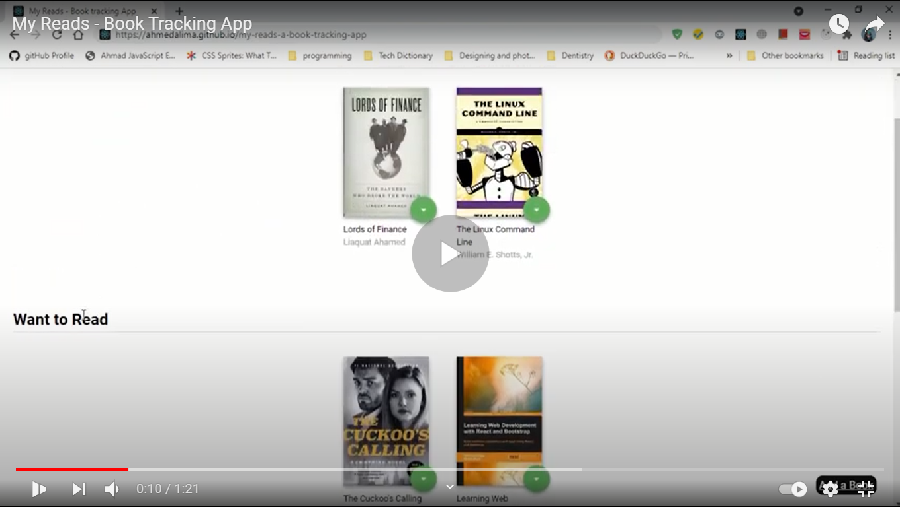
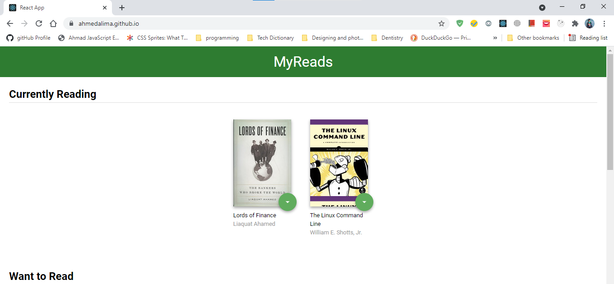
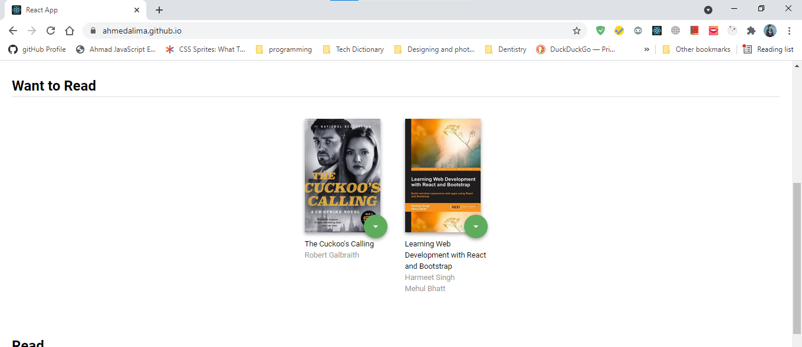
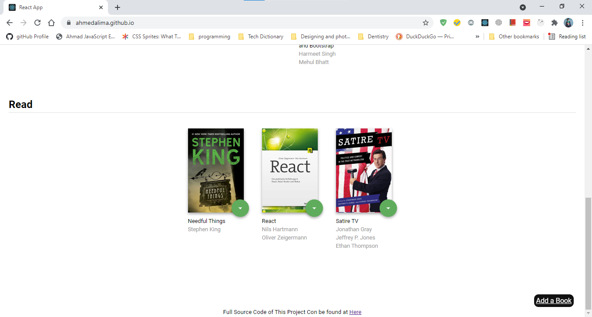
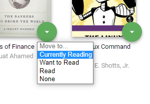
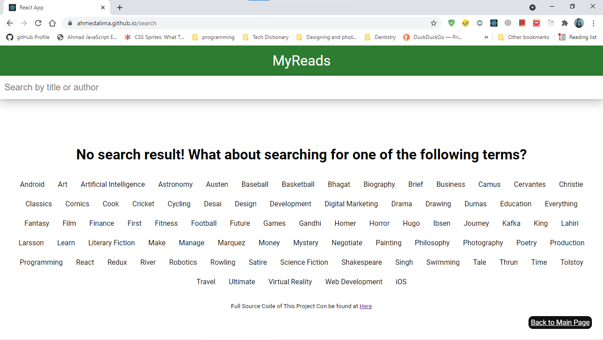
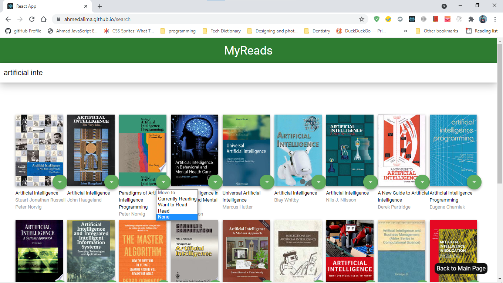

# Udacity Advanced front-end Nanodegree Project:

# My Reads - Book Tracking App

## Video Demo

A video walk through is available here: https://youtu.be/-sTkPmOTCBA including installation and app overview.

## What We will be building

In the MyReads project, I created a bookshelf app that allows you to select and categorize books you have read, are currently reading, or want to read. The project emphasizes using React to build the application and provides an API server and client library that you will use to persist information as you interact with the application.

# Technologies and Languages Used:

- Backend-Server:
  - Provided by Udacity
- UI (Front-end):

  - ReactJS

    - React Hooks
    - Functional Components.

  - Routing: `React Router DOM`

  - Typescript
  - HTML
  - style with pure CSS

- Tools:
  - Create-react-app
  - Git version Control System
  - Github
  - Github Pages, Live <a href="https://ahmedalima.github.io/my-reads-a-book-tracking-app/">Here</a>

## Interactions

### Home page

In this application, the main page displays a list of "shelves" (i.e. categories), each of which contains a number of books. The three shelves are:

- Currently Reading
  

- Want to Read
  

- Read

Each book has a control that lets you select the shelf for that book. When you select a different shelf, the book moves there. Note that the default value for the control should always be the current shelf the book is in.

# Search Page `/search`

The main page also has a link to `/search`, a search page that allows you to find books to add to your library.

The search page has a text input that may be used to find books. As the value of the text input changes, the books that match that query are displayed on the page, along with a control that lets you add the book to your library.

## Run project

Below shows how to run in development and production mode.

### Download Dependencies

`npm install` or `yarn`

### Start the Application

`npm run start` or `yarn start`

## Configs files

- Webpack
  - Typescript Configs: `tsconfig.json`
- Dependency
  - `package.json`
